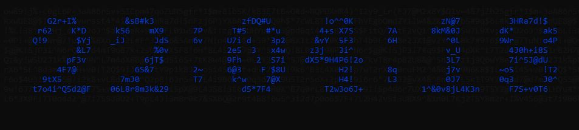

# Terminal Clock Project

### Example Output


## Description
This project is a terminal-based clock application written in Rust. It displays the current time and date in the terminal and updates every second. The project demonstrates the basics of Rust programming, including handling system time and terminal output. It is designed to be a simple, interactive tool for learning Rust.


## Project Structure
├── src
│   └── main.rs
├── Cargo.toml
├── Cargo.lock
├── .gitignore
└── README.md


## Getting Started

### Prerequisites

- Rust programming language (Install via [rustup](https://rustup.rs/))
- Cargo (Rust's package manager, included with Rust)
- A terminal or command prompt

### Installation

1. Clone the repository:

    ```sh
    git clone https://github.com/SyedFahad7/Terminal-Clock
    ```

2. Navigate into the project directory:

    ```sh
    cd TerminalClock
    ```

3. Build the project:

    ```sh
    cargo build
    ```

4. Run the application:

    ```sh
    cargo run
    ```

### Usage

- The application will start and display the current time and date in the terminal.
- It updates the time every second, providing a live clock display.

### Example Output


## License
This project is licensed under the MIT License.

## 🚀 About Me
I'm a full stack Web & App Developer and an undergrad Data Science Student 👨‍💻🙌

## Authors

- [@Fahad](https://github.com/SyedFahad7)
